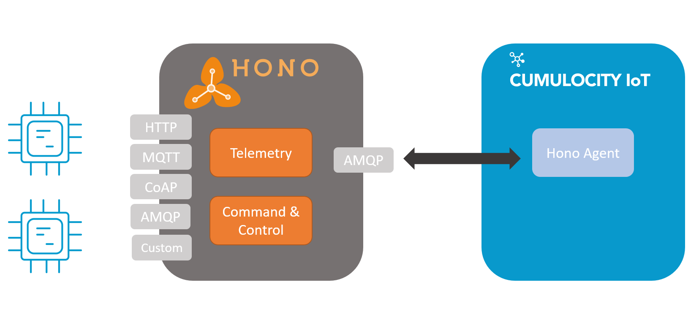

# Cumulocity Agent for Eclipse Hono

## Description
This is an Agent/Microservice that integrates with [Eclipse Hono](https://hono.eclipse.org). Hono is a an IoT Hub which handles the messaging of IoT Devices including Telemetry Data and Command & Control Data.
This Microservice will act as a Consumer Application, listens to all Telemetry & Event Data provided by Hono and forward the Data to Cumulocity. Vice Versa it transforms Cumulocity Operations to Hono Commands.



Each Hono Tenant is mapped to one Cumulocity Tenant this is why the Microservice isolation level is "Per-Tenant".
Currently only Telemetry & Event Data is supported by this Microservice. Command & Control functionality might be added later on.

This Microservices uses the [Hono Client](https://github.com/eclipse/hono/tree/master/client) and is based on Example Code from [IoT Hub Examples](https://github.com/bsinno/iot-hub-examples) by Bosch Software Innovations GmbH.

The [Cumulocity Microservice SDK](https://cumulocity.com/guides/microservice-sdk/introduction/) version 1005.6.1 in combination with Java 8 + Spring Boot 1.5 are used.

## Hono C8Y Data Mapping

### Telemetry & Events
When receiving Telemetry & Event Data the Microservice will create Devices with the Hono Device Id.
Also the payload of the Hono Message will be sent to Cumulocity as Event of Type `hono_Event` or `hono_Telemetry`. 

Example of Hono Event in Cumulocity:
```json
{
    "creationTime": "2019-12-16T10:45:51.920Z",
    "source": {
        "self": "https://t86833178.cumulocity.com/inventory/managedObjects/1418779",
        "id": "1418779"
    },
    "type": "hono_Telemetry",
    "self": "https://t86833178.cumulocity.com/event/events/1431569",
    "time": "2019-12-16T10:45:51.914Z",
    "text": "Hono Telemetry Message",
    "id": "1431569",
    "hono_Content": {
        "temp": 20.5
    }
}
```
As Hono is totally payload agnostic, no static Mapping is added to the Microservice. 

Apama allows dynamically to decode the Payload of Hono Messages without touching the code of this Microservice.
You can find an Apama Monitor Example to Map Temperature Telemetry Data to a Temperature Measurement [here](/src/apamamapper/TempMapper.mon)

Example: Hono sends `{"temp": 20.5}`. The Apama Example Monitor will create a Temperature Measurement of Type `c8y_TemperatureMeasurement` with the same value and Timestamp of the system (as no timestamp is provided).

### Command & Control

For Command & Control the Data Mapping is mainly done be defining the Data Model of the Operation so that the Hono Command & Control/Device can interpret and execute that command. 
The following Properties/Fragments could be maintained in the Operation:
 - `hono_Command` (Required) - The command sent by the Platform.
 - `hono_OneWay` (Optional) - If Set to `true` One-Way Commands will be sent to Hono. The Operation will be set to SUCCESSFUL or FAILED when delivered to Hono
 - `hono_Data` (Optional) - Additional data to be used by the command e.g. Software List etc.
 - `hono_ContentType` (Optional) - The Content Type of the `hono_Data`. Should be maintained when Data is available.
 - `hono_Headers` (Optional) - Any additional Headers which should be sent to the Device.
Here is an example of an interpretable Operation:

```json
{
  "deviceId" : "1418779",
  "hono_Command": "switch",
  "hono_Data": "on",
  "hono_OneWay": true,
  "description": "Hono Command Example"
}
```

Operations can be created by either adding `c8y_SupportedOperations` on the Device in Cumulocity or using the API to define and create [Operations with custom Fragments](https://cumulocity.com/guides/reference/device-control/). 

## Prerequisites

- An Hono Instance or a Tenant in the [Hono Sandbox](https://www.eclipse.org/hono/sandbox/) is required.
- A Cumulocity Tenant with Admin Privileges and Microservice Deployment Feature is required. You can request a free trial [here](https://cumulocity.com/try-cumulocity-free/).


## Preparations & Setup
1. Make sure you have the following Hono Configuration Data at hand:
   - `hono.host` - Hostname of AMQP Host
   - `hono.port` - Port of AMQP Host
   - `hono.username` - Hono Username
   - `hono.password` - Hono Password
   - `hono.tenantid` - The Id of the Hono Tenant that should be matched to the Cumulocity Tenant
   
2. You can store/change the above configuration in 2 ways.
   - In Cumulocity Tenant Options.
   - In the properties file of the Microservice.
   
   It is preferred to store the above configuration in the Tenant Options. Just make sure you create them for the category `hono`.
   The key should be the above mentioned configuration in lowercase. For the password please use the key `credentials.password` to encrypt the password.
   You can find the Tenant Options API Description [here.](https://cumulocity.com/guides/reference/tenants/#option-collection)
   
   Example Payload for Tenant Options: 
   ```json
   {
       "category": "hono",
       "key": "host",
       "value": "hono.eclipse.org"
   }
   ```
   
   As an alternative you can just add the hono configuration to the `application.properties` in the resources folder.
   You can find an example the the resources folder.

## Build
Make sure that [Docker](https://www.docker.com/) and [Apache Maven](https://maven.apache.org/) are installed and running on your Computer.
Run `mvn clean package` to build the Microservice which will create a ZIP archive you can upload to Cumulocity.

## Deploy
1. Login to your Cumulocity Tenant. Go to Administration -> Applications. Click on "Add Application" and "Upload Microservice".
2. Select the zip archive generated by the [Build](#build).
    > NOTE: Rename the zip archive to "hono-agent.zip" before uploading it
3. Wait until the Microservice is uploaded and started. You can check that under the application and Status.
4. In the "Log" Tab you can check the Logfiles of the Agent.

______________________
These tools are provided as-is and without warranty or support. They do not constitute part of the Software AG product suite. Users are free to use, fork and modify them, subject to the license agreement. While Software AG welcomes contributions, we cannot guarantee to include every contribution in the master project.	
______________________
For more information you can Ask a Question in the [TECHcommunity Forums](http://tech.forums.softwareag.com/techjforum/forums/list.page?product=cumulocity).

You can find additional information in the [Software AG TECHcommunity](http://techcommunity.softwareag.com/home/-/product/name/cumulocity).

_________________
Contact us at [TECHcommunity](mailto:technologycommunity@softwareag.com?subject=Github/SoftwareAG) if you have any questions.
